# NF5AA5-Signatura digital i correu segur

## Presentació de l'activitat

El correu electrònic és un dels serveis més utilitzats a Internet. La seva popularitat es deu a la seva facilitat d'ús i a la seva gratuïtat. No obstant això, el correu electrònic també és un dels serveis més vulnerables a atacs de seguretat, com ara el phishing, el spam i els virus.

Per aquest motiu, les organitzacions necessiten implementar mesures de seguretat per protegir els seus sistemes de correu electrònic i les dades dels seus usuaris.

Els grans reptes a resoldre són:

- Assegurar identitat del remitent.
- Detectar modificacions del missatge original.
- Garantir la confidencialitat del missatge.

Els sistemes de clau pública/privada són els que permeten resoldre aquests reptes garantint:

- **Confidencialitat**: només destinatari pot llegir el correu xifrat amb la clau pública amb la seva clau privada.
- **Vinculació**: podem assegurar el remitent si es signa el correu amb la clau privada. Els destinataris usaran la clau pública del remitent per fer la comprovació.
- **Integritat**: realment se signa un resum (hash) del correu, el que permet verificar també la no modificació.

Les solucions de criptografia de clau pública es basen en un punt clau, poder confiar en la identitat de l’altre.

Dues formes de solucionar el problema:

- Confiar en autoritats de certificació (PKI) que emeten certificats per usuaris i organitzacions.
- Usar xarxes descentralitzades on la confiança prové d’altres contactes.

Per usar la solució del certificat cal un de vàlid (VeriSign, Camerfirma, IDCat, DNIe, etc.) i instal·lar-lo al sistema operatiu i al client de correu. Aquí **la confiança es basa en l’autoritat de certificació** que ha emès el certificat.

La solució de xarxes descentralitzades és la que s’usa amb PGP (Pretty Good Privacy) i GPG (GNU Privacy Guard). Aquí **la confiança es basa en la xarxa de contactes** que signen el certificat.

### Durada de l'activitat

Durada prevista: 2 hores

### Objectius de l'activitat

- Implementar mesures de signatura digital i xifrat de correu electrònic.
- Validar funcionament de la signatura digital i xifrat de correu electrònic.

### Competències treballades

p) Aplicar els protocols i normes de seguretat, qualitat i respecte al medi ambient en les intervencions realitzades.

### Resultats d'aprenentatge i criteris d'avaluació

RA4. Assegura la privadesa de la informació transmesa en xarxes informàtiques descrivint vulnerabilitats i instal·lant programari específic.

4.7 Utilitza sistemes d'identificació com la signatura electrònica, certificat digital, entre altres.

### Continguts

4.5 Sistemes d'identificació: signatura electrònica, certificats digitals i altres.

### Capacitats clau

|             |                         |                    |
|------       |---------                |----------          |
|Autonomia    |Organització del treball |Treball en equip    |
|~~Innovació~~|Resolució de problemes   |Responsabilitat     |
|             |Relació interpersonal    |                    |

## Enunciat de l'activitat

Assegurarem el correu electrònic fent servir el servei de [Mailvelope](https://www.mailevelope.com/). Aquest servei permet xifrar i signar correus electrònics amb PGP, és un servei gratuït (amb limitacions) i es basa en GPG (GNU Privacy Guard). Mailvelope inclou una extensió del navegador que permet xifrar i signar correus electrònics directament des del client de correu web.

Tot i que es basa en la filosofia descentralitzada, en aquest cas, s'usa el repositori de claus públiques de Mailvelope, que permet compartir claus públiques amb altres usuaris. Això facilita la comunicació segura amb altres persones que també utilitzen Mailvelope.

La solució ofereix dues opcions:

- **Mailvelope for Business**: és una solució de pagament que permet a les organitzacions gestionar claus públiques i privades dels seus usuaris. Aquesta solució és ideal per a organitzacions que necessiten un control més gran sobre la seguretat del correu electrònic.
- **Mailvelope for You**: és una solució gratuïta que permet als usuaris particulars xifrar i signar correus electrònics. Aquesta solució és ideal per a usuaris que necessiten una solució de seguretat bàsica per al seu correu electrònic.

### Entorn de treball

- Navegador web (Chrome, Firefox, Edge, etc.)
- Compte de Mailvelope. Podeu crear un compte gratuït a Mailvelope per a l'activitat.
- Compte de correu electrònic de Gmail. Es recomana no usar el corporatiu perquè no permet integrar el plugin de forma gratuïta. Podeu crear un compte de correu electrònic gratuït a Gmail per a l'activitat.

### Instruccions de l'activitat

#### 1. Instal·lació del complement Mailvelope al navegador web

El primer pas és instal·lar el complement pel navegador web que es pot trobar a la secció de complements del navegador, per exemple, a la Chrome Web Store.

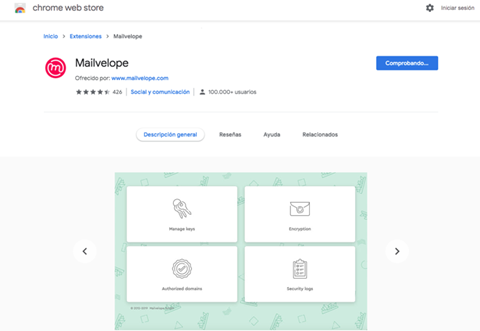

#### 2. Creació de les claus

Un cop instal·lat, es pot accedir a la configuració del complement fent clic a la icona de Mailvelope al navegador.

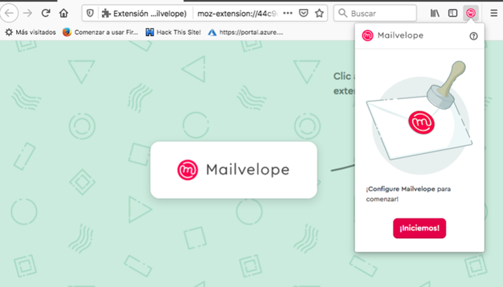

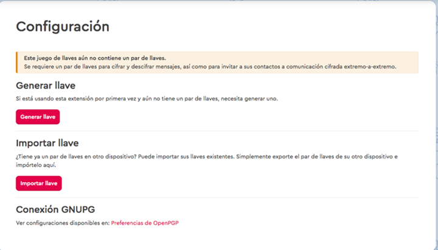

Ara toca crear el parell de claus públiques i privades. Per fer-ho, cal anar a la secció de "Claus" i fer clic a "Crear un nou parell de claus". La clau pública es puja al servidor de claus de Mailvelope, tot i que també es podria pujar a altres repositoris de claus públiques.

Com configuracions extra,  es pot definir la caducitat de la clau i triar entre RSA i un algoritme de nova generació de corba el·líptica, així com la mida de la clau.

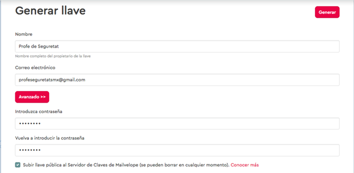

#### 3. Exportació de les claus (còpia de seguretat)

És important exportar les claus per disposar de una còpia de seguretat, ja que **si es perden no podrem recuperar els correus que haguem rebut xifrats**.

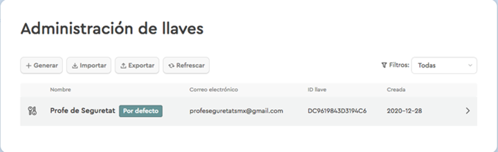

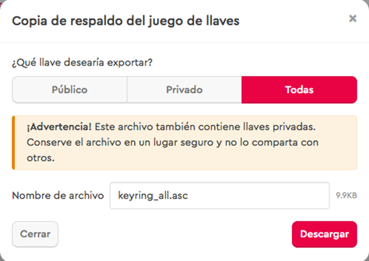

### 4. Comprovació i verificació

Rebrem un correu per comprovar el correcte funcionament del servei i verificar l’adreça. Un cop clicat l’enllaç, la nostra clau estarà disponible al servidor de Mailvelope.

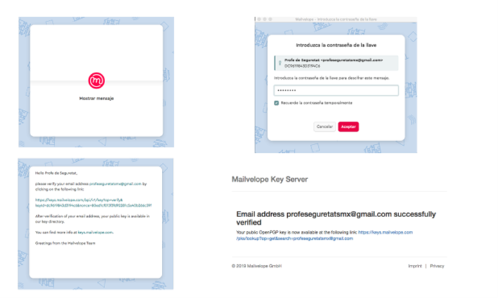

### 5. Configuració amb Gmail

Mailvelope es pot usar com un complement on escrivim i llegim els correus, però si ho volem integrar amb Gmail, cal donar-li permisos. Si no, caldrà copiar i enganxar el text xifrat a Gmail.

### 6. Exemples d'ús

Si se signa el correu, el destinatari podrà verificar que el remitent és qui diu ser i que el missatge no ha estat modificat.

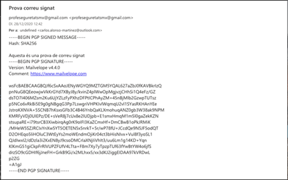

En el cas que qui rebi el correu tingui el complement habilitat, automàticament li surt la verificació del remitent i la integritat del missatge.

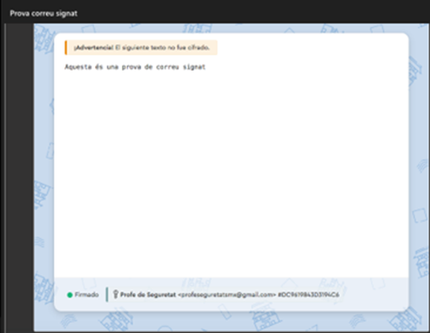

Per enviar un correu xifrat i signat, cal que el destinatari disposi de la seva clau pública i que estigui penjada al servidor de Mailvelope.

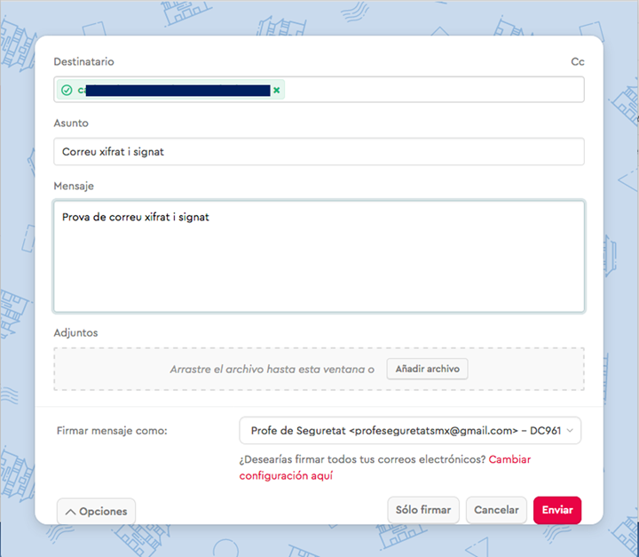

Com s'ha comentat anteriorment, es pot treballar directament des del plugin, sense usar la integració amb Gmail, bé perquè el servei de correu sigui un altre o bé perquè no es vulgui donar permisos a Mailvelope per accedir al compte de Gmail.

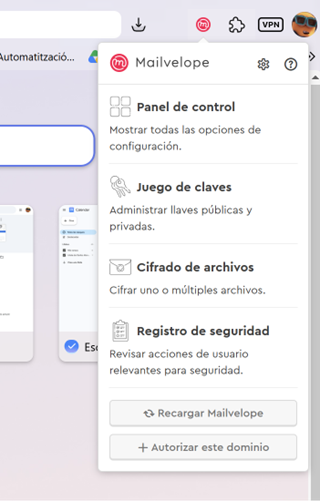

### Documentació i Informe Final

Crear una guia explicativa de la configuració i ús del servei de Mailvelope, amb captures de pantalla i explicacions dels passos realitzats. Aquesta guia ha d'incloure:

- Instal·lació del complement al navegador web.
- Configuració del compte de Mailvelope per un compte de Gmail.
- Enviament correu signat i xifrat al compte de Gmail que indiqui el professor.
- Proves d'enviament i recepció de correus signats i xifrats i només signats amb un company de classe.

La guia ha de servir perquè un usuari sigui capaç de configurar i utilitzar el servei de Mailvelope per enviar i rebre correus electrònics signats i xifrats.

## Enllaços d'interès

- [Camerfirma. Cómo firmar un correo o mail de Outlook (YouTube)](https://youtu.be/SvwbY4yFow0?si=LB73bIB36aQK1_WE)

- [Mailvelope](https://www.mailevelope.com/es)
